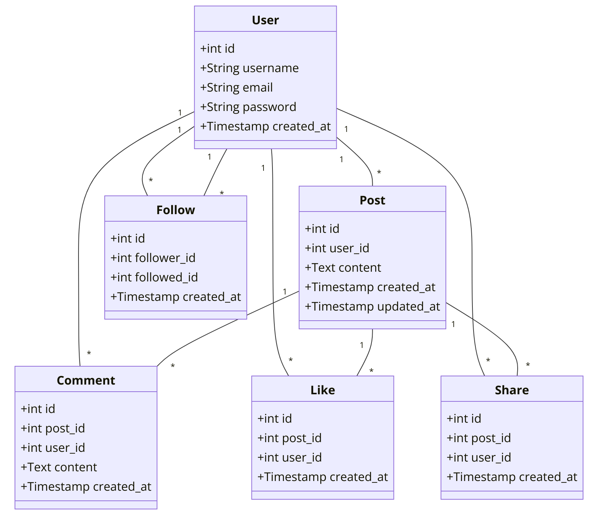

# Newsfeed API

This is a simple newsfeed application API built with Flask, following SOLID principles and best practices. The application supports basic entities like User, Post, Comment, Like, Share, and Follow/Friendships.

## ERD Diagram




## Getting Started

### Prerequisites

- Python 3.8+
- MySQL or MariaDB

### Installation

1. Clone the repository
   ```sh
   git clone <repository_url>
   cd newsfeed

2. Create Virtual Environment
3. python3 -m venv .env
source .env/bin/activate
4. pip install -r requirements.txt

5. CREATE DATABASE newsfeed_app;

6. flask run

## API Documentation

The API documentation is available at `/swagger` once the application is running.

## API Endpoints

### Auth

- **Register**: `POST /auth/register`
- **Login**: `POST /auth/login`
- **Refresh Token**: `POST /auth/refresh`

### Posts

- **Create Post**: `POST /posts`
- **Get All Posts**: `GET /posts`
- **Get Post by ID**: `GET /posts/{post_id}`
- **Update Post**: `PUT /posts/{post_id}`
- **Delete Post**: `DELETE /posts/{post_id}`

### Comments

- **Add Comment**: `POST /comments`
- **Get Comments by Post**: `GET /comments/post/{post_id}`

### Likes

- **Add Like**: `POST /likes`
- **Get Likes by Post**: `GET /likes/post/{post_id}`
- **Delete Like**: `DELETE /likes/{like_id}`

### Shares

- **Add Share**: `POST /shares`
- **Get Shares by Post**: `GET /shares/post/{post_id}`
- **Delete Share**: `DELETE /shares/{share_id}`

### Follows

- **Add Follow**: `POST /follows`
- **Get Followers**: `GET /follows/user/{user_id}/followers`
- **Delete Follow**: `DELETE /follows/{follow_id}`
